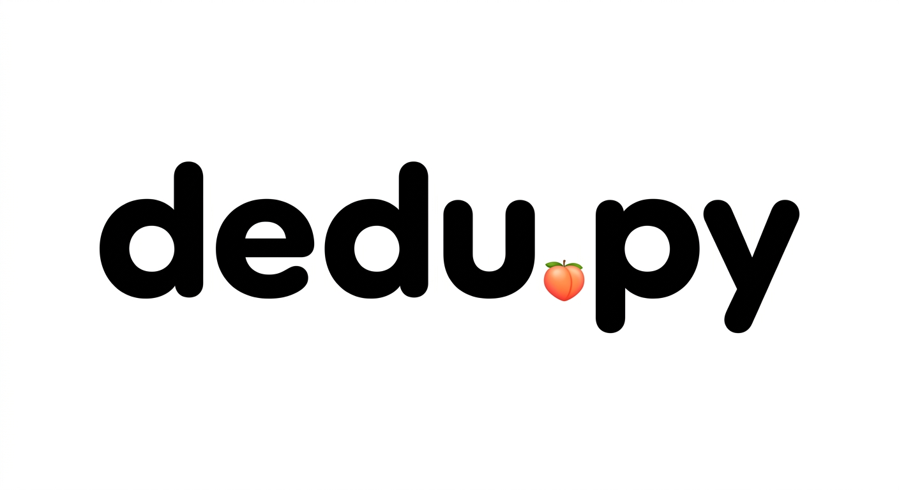

# dedu.py 🍑



**dedu.py** to ultra-szybkie i absurdalnie proste narzędzie open-source do deduplikacji plików. Jeśli Twój dysk pęka w szwach od kopii tych samych memów i dokumentów, jesteś w dobrym miejscu.

## ✨ Funkcje
* **Szybkość:** Algorytmy, które robią robotę szybciej niż zdążysz powiedzieć "kocie ruchy".
* **Bezpieczeństwo:** Porównujemy hashe, nie tylko nazwy. Twoje dane są bezpieczne.
* **Lekkość:** Czysty Python, zero zbędnych zależności.

## 🚀 Instalacja
```bash
git clone [https://github.com/murvudd/dedu_py.git](https://github.com/murvudd/dedu_py.git)
cd dedu_py
pip install -r requirements.txt
```

## 🛠 Użycie
Wystarczy wskazać folder, który chcesz wyczyścić:
```bash
python dedu.py /sciezka/do/balaganu

```
###### 

## 🤝 Contributing
Masz pomysł na poprawkę? Pull requesty mile widziane. Pamiętaj tylko o zachowaniu stylu!
---


---

<div align="center">

#### Created with 🍑 by **[murvudd](https://www.linkedin.com/in/mike-trojnarski/)**

[](https://github.com/murvudd)
[](https://gitlab.com/michal_trojnarski)
[](https://www.linkedin.com/in/mike-trojnarski/)
[](https://www.reddit.com/user/simply_pretentious)
[](https://wykop.pl/ludzie/simply_pretentious)

**Copyright © 2026 Michał Trojnarski Full Stack AI** *Built for speed, coded for fun.*

</div>